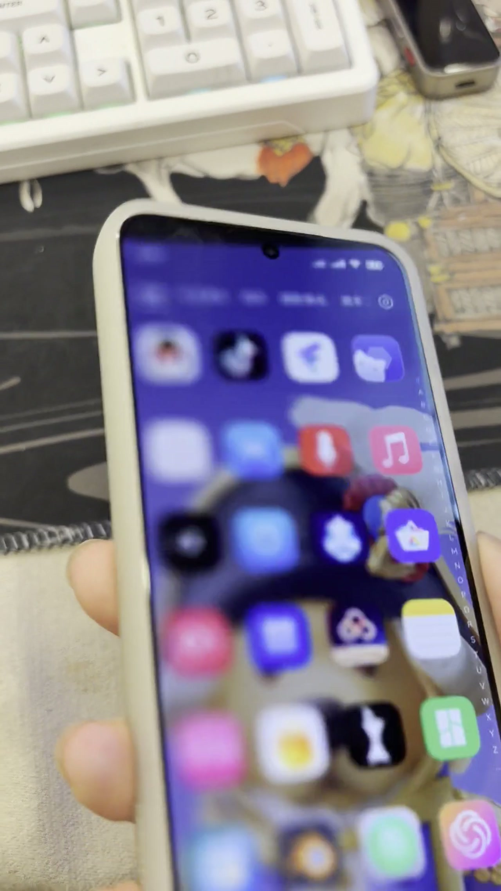
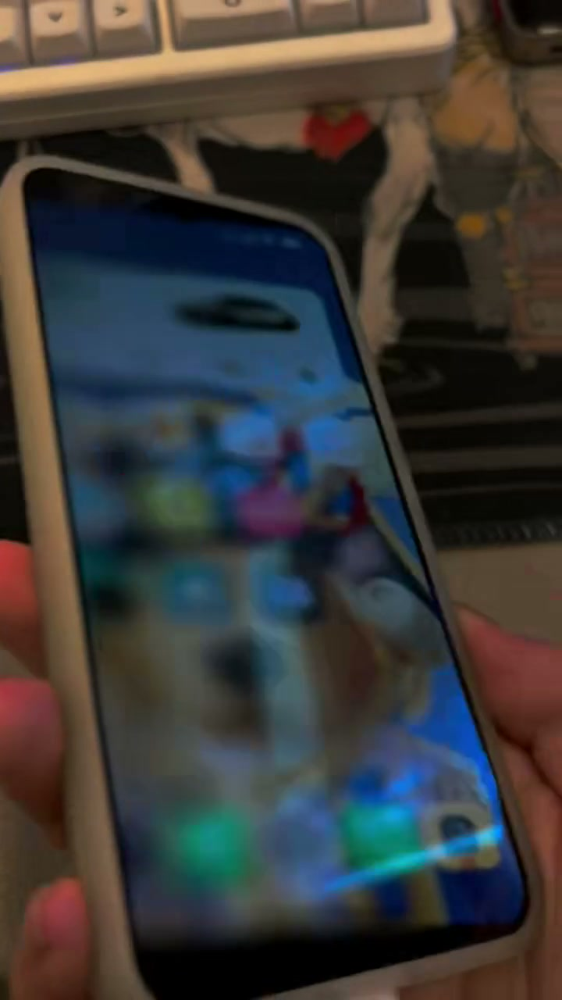

# Duo Fold for Android

在 Android 设备上实现 iPhone Duo 风格的整屏翻折动效。界面会跟随手机的左右、前后倾斜实时投影，可暂停、反向移动，并支持横竖屏方向映射。

## 实机测试视频

<a href="https://github.com/jcx396905-gif/DuoFold/releases/download/v0.3.1/DuoFold-full-test.mp4"></a>

▶ [播放完整测试视频（约 30 秒）](https://github.com/jcx396905-gif/DuoFold/releases/download/v0.3.1/DuoFold-full-test.mp4)

<a href="https://github.com/jcx396905-gif/DuoFold/releases/download/v0.3.1/DuoFold-demo-clip.mp4"></a>

▶ [播放演示切片（约 6 秒）](https://github.com/jcx396905-gif/DuoFold/releases/download/v0.3.1/DuoFold-demo-clip.mp4)

## 下载

从 [Latest Release](https://github.com/jcx396905-gif/DuoFold/releases/latest) 下载 `DuoFold-0.3.1.apk`。

## 功能

- 将正在使用的整个 Android 屏幕作为连续空间进行透视、位移、磨砂与明暗处理。
- 使用手机姿态传感器实时控制动画，停住手机时画面同步停住，反向倾斜时动画反向播放。
- 默认响应左右翻转；开启“Z 轴感应 · 前后倾斜”后，同时响应前后方向，斜向动作会连续合成。
- 自动适配横屏和竖屏，并将传感器方向映射到当前屏幕坐标。
- 不修改桌面或第三方应用布局，可在当前正在使用的界面上显示效果。
- 三指触屏、通知栏操作或返回 Duo Fold 均可停止并恢复原始画面。

## 使用要求

- Android 14 或更高版本。
- [Shizuku](https://github.com/RikkaApps/Shizuku) 已安装并运行。
- 无需 Root。
- 已在 Xiaomi 15、Android 16 上完成实机测试。其他厂商系统对屏幕捕获和悬浮层的限制可能不同。

## 使用教程

1. 从 [Latest Release](https://github.com/jcx396905-gif/DuoFold/releases/latest) 下载并安装 APK。
2. 打开 Shizuku，按其提示通过无线调试或电脑 ADB 启动服务。
3. 打开 Duo Fold，点击“01 连接并授权 Shizuku”，在授权窗口中允许访问。
4. 点击“02 开启屏幕效果辅助服务”，找到 Duo Fold 并启用服务。
5. 正对屏幕，以自然握姿点击“03 体验 10 秒”。左右倾斜手机即可查看翻折效果。
6. 根据手感调整“最大倾斜角度”和“空间强度”。需要前后方向时打开“Z 轴感应 · 前后倾斜”。参数在下一次开启效果时生效。
7. 点击“04 开启全局效果”。需要更换握姿时返回应用，点击“重新校准当前握姿”。
8. 三指同时触屏或使用通知栏停止按钮，即可退出效果。

如果辅助服务显示已连接但无法启动效果，请重新打开一次辅助服务开关。部分 Xiaomi 系统在修正触控时还需要打开开发者选项中的“USB 调试（安全设置）”。

## 工作方式

Duo Fold 通过 Shizuku 获取当前显示画面，在本机内存中交给 OpenGL ES 实时投影。游戏旋转矢量与陀螺仪用于计算相对姿态；画面根据当前显示方向重建，横竖屏切换后自动重新校准。

默认参数使用 80° 最大倾斜角度、100% 空间强度、6–32 个模糊采样和 40 ms 陀螺仪预测。为控制功耗，捕获宽度上限为 1080 像素，更新上限为每秒 30 次。

## 隐私与限制

- 应用没有网络权限，正常使用时不保存、不上传屏幕画面。
- 效果层会从系统截图中排除，避免画面被重复捕获。
- 受保护或禁止截屏的界面可能显示黑色。
- 应用只改变最终显示效果，不会重新排列第三方应用内部的图标、文字或组件。
- 长时间使用会增加 GPU 负载与耗电。

## 从源码构建

需要 JDK 17 和 Android SDK 36：

```shell
./gradlew :app:assembleDebug :motion:test :app:lintDebug
```

生成的 APK 位于 `app/build/outputs/apk/debug/app-debug.apk`。

项目包含两个模块：`app` 负责 Shizuku、辅助服务、画面捕获和 OpenGL ES 渲染；`motion` 负责姿态轴映射、滤波与投影数学，可独立运行 JVM 单元测试。

## 作者

[jcx](https://github.com/jcx396905-gif)

## 许可证

项目以 MIT License 发布。第三方许可证声明见 `app/src/main/assets/THIRD_PARTY_NOTICES.txt`。
